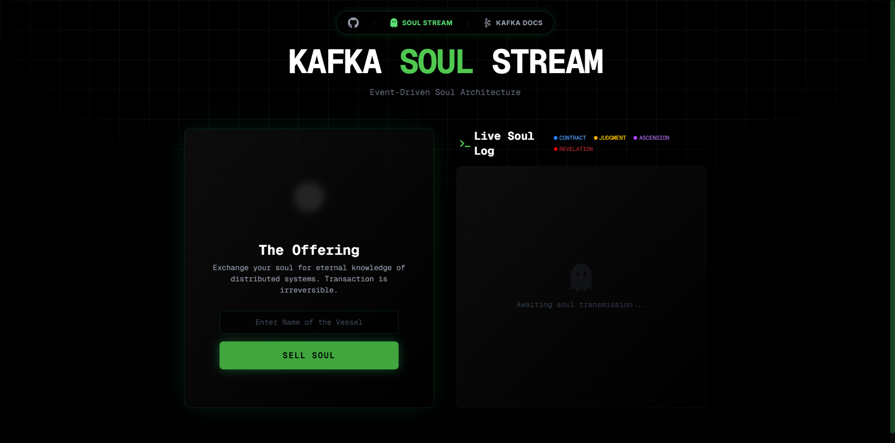
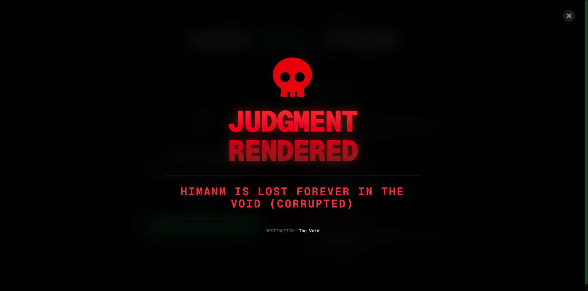
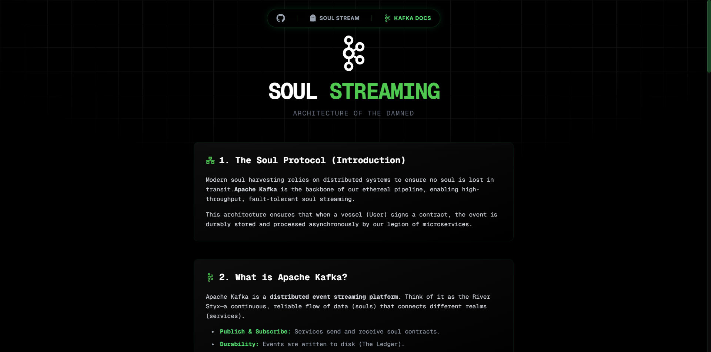
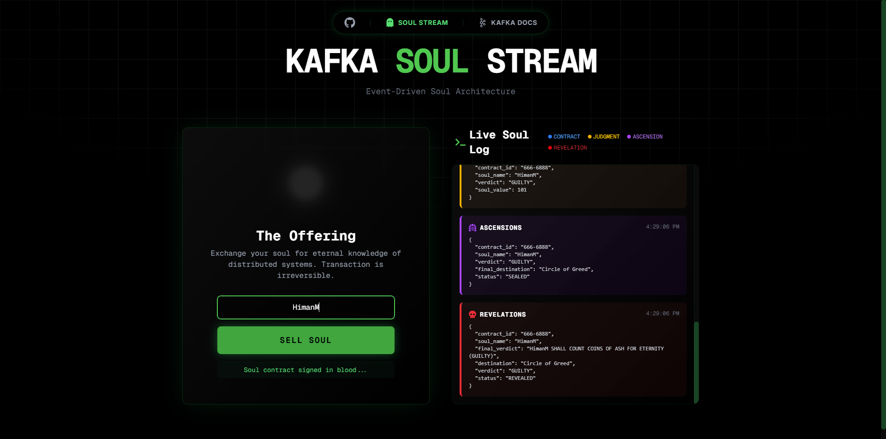
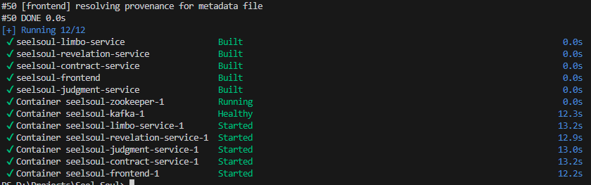
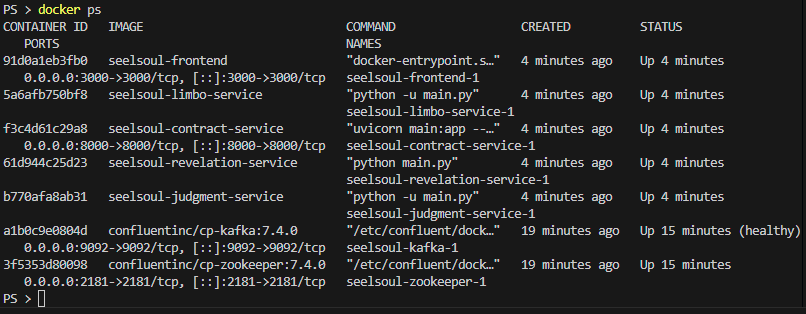

# 💀 Soul Stream: Event-Driven Architecture of the Damned

> *A distributed soul harvesting system powered by Apache Kafka. Built to master the dark arts of Event Streaming.*


## 🕯️ The Prophecy (Introduction)

**Soul Stream** is a microservices-based application that simulates a "Soul Selling" process. It demonstrates the power of **Apache Kafka** to decouple services and ensure that no soul (data) is ever lost in the void, even if the gatekeepers (services) are asleep.

**NOTE:** This is a **learning project** designed to explore Kafka, Docker Compose, and Event-Driven Architecture.

## 📸 Glimpses of the Void (Screenshots)

| The Offering (Frontend) | The Verdict (Revelation) |
|:-----------------------:|:------------------------:|
|  |  |

| The Architecture (Docs) | Live Soul Log |
|:-----------------------:|:------------------------:|
|  |  |

## 🏰 The Realms (Microservices)

The system is composed of 4 independent services (Realms) communicating purely through Kafka events:

1.  **Contract Service** (`contract-service`):
    *   **Role:** The entry point. Accepts the user's name and signs the blood contract.
    *   **Tech:** Python, FastAPI.
    *   **Event:** Produces `contracts`.

2.  **Judgment Service** (`judgment-service`):
    *   **Role:** Consumes contracts and judges the soul (Guilty, Pure, etc.).
    *   **Tech:** Python, AIOKafka.
    *   **Event:** Consumes `contracts` → Produces `judgments`.

3.  **Limbo Service** (`limbo-service`):
    *   **Role:** The sorting hat. Assigns a final destination (Void, Greed, Frozen Lake).
    *   **Tech:** Python, AIOKafka.
    *   **Event:** Consumes `judgments` → Produces `ascensions`.

4.  **Revelation Service** (`revelation-service`):
    *   **Role:** The final messenger. Delivers the dramatic final verdict to the user.
    *   **Tech:** Python, AIOKafka.
    *   **Event:** Consumes `ascensions` → Produces `revelations`.

5.  **Frontend** (`frontend`):
    *   **Role:** The visual interface for the mortal user.
    *   **Tech:** Next.js, TailwindCSS, Framer Motion, WebSockets.

## 🔮 The Ritual (How to Run)

Summon the entire infrastructure with a single incantation:

```bash
docker-compose up -d --build
```

Access the portal at: `http://localhost:3000`

## 📜 The Scrolls of Truth (Infrastructure Evidence)

To prove the ritual was successful, observe the following manifestations:

### 1. The Summoning (Build & Start)


### 2. The Gatekeepers (Running Containers)



## 📜 The Soul Protocol (Event Flow)

1.  **Mortal** enters name → **Contract Service** (HTTP).
2.  **Contract Service** → Kafka `contracts` topic.
3.  **Judgment Service** → Reads `contracts` → Kafka `judgments` topic.
4.  **Limbo Service** → Reads `judgments` → Kafka `ascensions` topic.
5.  **Revelation Service** → Reads `ascensions` → Kafka `revelations` topic.
6.  **Frontend** → Listens via WebSocket → Displays Final Verdict.

## 🛠️ Tech Stack

*   **Core:** Apache Kafka, Zookeeper
*   **Backend:** Python 3.9, FastAPI, AIOKafka
*   **Frontend:** Next.js 15, React 19, TailwindCSS, Framer Motion
*   **Infrastructure:** Docker, Docker Compose

---
*Created by HimanM as a journey into the depths of Distributed Systems.*
